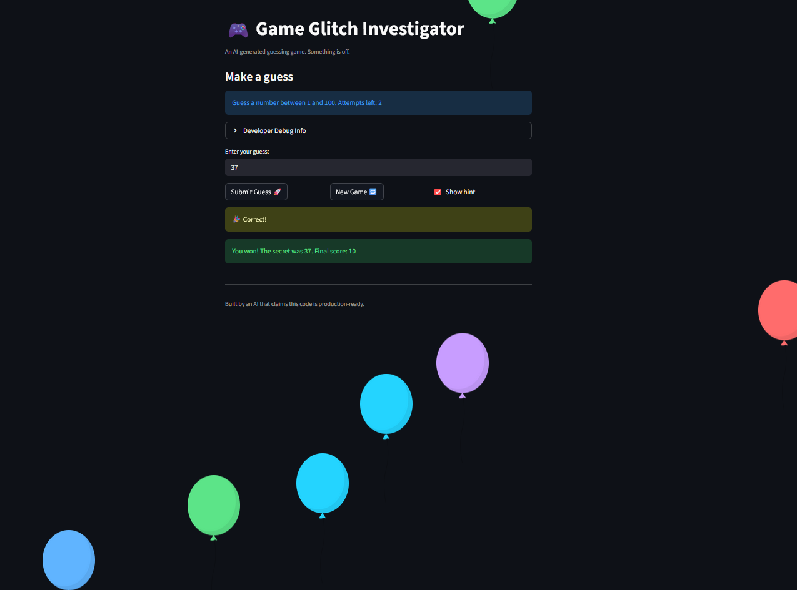

# 🎮 Game Glitch Investigator: The Impossible Guesser

## 🚨 The Situation

You asked an AI to build a simple "Number Guessing Game" using Streamlit.
It wrote the code, ran away, and now the game is unplayable. 

- You can't win.
- The hints lie to you.
- The secret number seems to have commitment issues.

## 🛠️ Setup

1. Install dependencies: `pip install -r requirements.txt`
2. Run the broken app: `python -m streamlit run app.py`

## 🕵️‍♂️ Your Mission

1. **Play the game.** Open the "Developer Debug Info" tab in the app to see the secret number. Try to win.
2. **Find the State Bug.** Why does the secret number change every time you click "Submit"? Ask ChatGPT: *"How do I keep a variable from resetting in Streamlit when I click a button?"*
3. **Fix the Logic.** The hints ("Higher/Lower") are wrong. Fix them.
4. **Refactor & Test.** - Move the logic into `logic_utils.py`.
   - Run `pytest` in your terminal.
   - Keep fixing until all tests pass!

## 📝 Document Your Experience

Game Purpose:
A number guessing game where the player tries to guess a secret number between 1 and 100 within a limited number of attempts. The game provides hints after each guess to guide the player toward the correct answer.
Bugs Found:

Inverted hints — check_guess returned "Go HIGHER" when the guess was too high and "Go LOWER" when it was too low, making the game impossible to win by following hints.
Attempts off by one — st.session_state.attempts was initialized to 1 instead of 0, giving the player one fewer attempt than the stated limit.
Secret cast to string — Every even-numbered attempt converted the secret number to a string, causing incorrect string-vs-integer comparisons and random hint failures.
No input validation — parse_guess accepted numbers outside the 1-100 range, including negative numbers and values over 100.
New Game didn't reset state — Clicking New Game didn't reset session_state.status, score, or history, leaving the game stuck in a "lost" state.

## 📸 Demo

## 🚀 Stretch Features

- [ ] [If you choose to complete Challenge 4, insert a screenshot of your Enhanced Game UI here]
